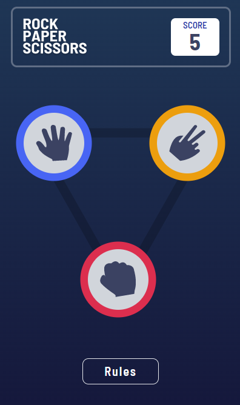

# Frontend Mentor - Rock, Paper, Scissors solution

This is a solution to the [Rock, Paper, Scissors challenge on Frontend Mentor](https://www.frontendmentor.io/challenges/rock-paper-scissors-game-pTgwgvgH). Frontend Mentor challenges help you improve your coding skills by building realistic projects.

### The challenge

Users should be able to:

- View the optimal layout for the game depending on their device's screen size
- Play Rock, Paper, Scissors against the computer
- Maintain the state of the score after refreshing the browser _(optional)_

### Screenshot

### Links

- Solution URL: [Solution](https://www.frontendmentor.io/solutions/rock-paper-scissors-game-OqX2_xxv6g)
- Live Site URL: [Live Site](https://rock-paper-scissors-coral-nu.vercel.app/)

## My process

### Built with

- CSS custom properties
- Flexbox
- Mobile-first workflow
- [React](https://reactjs.org/) - JS library
- [Vercel](https://vercel.com/) - For deployment
- [Tailwind CSS](https://tailwindcss.com/) - For styles

## Author

- Frontend Mentor - [@JaacielBriseo](https://www.frontendmentor.io/profile/JaacielBriseo)
